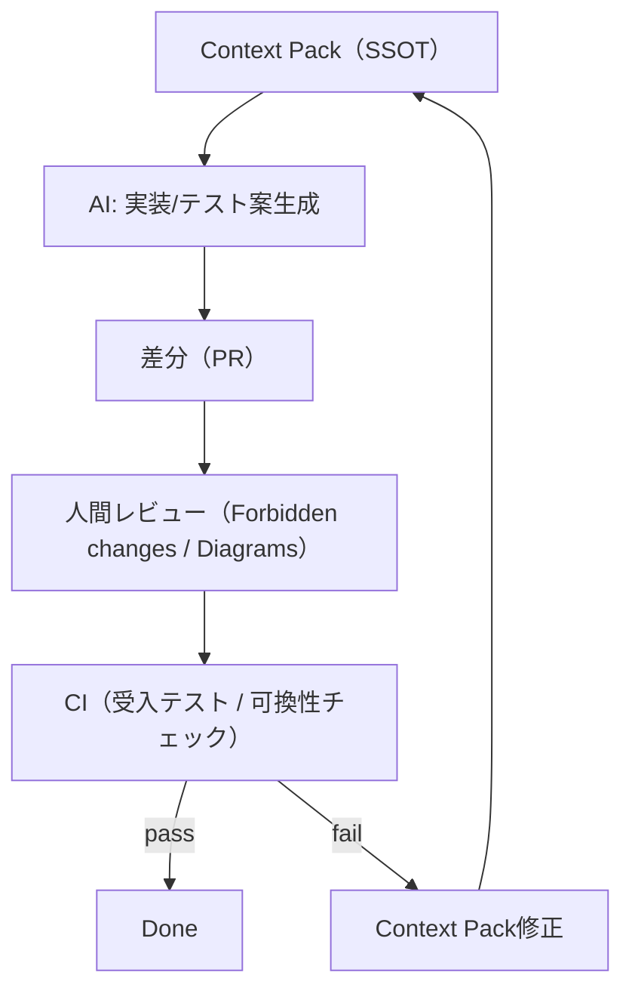

# 第1章: AIエージェント開発の分担モデルと設計成果物

## 学習ゴール

- 人間とAIの責任分界（要件/設計/検証 vs 実装/テスト/リファクタ）を説明できる
- 「設計成果物＝AIへの入力契約」という前提で、成果物の最小セットを定義できる
- Context Pack v1 の構造を理解し、最小の入力として作成できる

## 圏論コア（定義・直観・ミニ例）

本書では、圏論を「AIに委任可能な実装作業」を安定化させるための共通言語として用います。ここでは形式的な定義を最小限に留め、設計成果物への射影に必要な語彙だけを先に導入します。

- 対象（Object）: 状態や型をもつ「要素」
- 射（Morphism）: 対象から対象への「変換（操作/API/関数）」
- 合成（Composition）: 射をつなげて新しい射を作る（`g ∘ f`）
- 恒等射（Identity）: 何もしないが、合成の単位元として振る舞う（`id_A`）
- 図式（Diagram）と可換性（Commutativity）: 複数の経路で同じ結果に到達する、という要件（不変条件）を表す

ミニ例（直観）:

「注文を確定する」処理が複数の手続き（在庫引当、決済、監査ログ）に分かれているとき、実装では順序や再試行の影響で破綻しやすい。そこで「どの経路を辿っても最終的に同じ状態になる」「監査ログが必ず残る」などを、可換図式（不変条件）として固定し、後段の実装・テスト生成の拠り所にします。

## ソフトウェア設計への射影（どこに効くか）

AIは実装・テスト生成に強い一方、仕様の曖昧さを「それらしく補完」してしまう。よって人間は、後段で補完してはいけない情報を先に固定し、AIへ引き渡す必要があります。

### 分担モデル（推奨）

- 人間が固定する（委任しない）:
  - 目的/非目的（Non-goals）
  - 境界（対象/責務/権限）と用語（Glossary）
  - 不変条件（Diagrams）と受入条件（Acceptance tests）
  - 制約（Constraints）と禁止事項（Forbidden changes）
- AIに委任しやすい:
  - 実装スケルトン生成（ディレクトリ/インタフェース/雛形）
  - 受入テストの具体化、テストデータ生成
  - リファクタ（意味保存が前提）

### 失敗パターン（AI任せで壊れるポイント）

| 失敗パターン | 典型症状 | 予防策（設計成果物） |
| --- | --- | --- |
| 仕様が曖昧 | 期待しない挙動の実装が「それらしく」出来上がる | Problem statement（Goals/Non-goals）＋Glossary |
| 境界が不明 | モジュール分割や責務がぶれる | Objects/Morphisms（境界ごとに列挙） |
| 不変条件が未定義 | リファクタや最適化で意味が壊れる | Diagrams（可換性）＋Acceptance tests |
| 失敗条件/権限が欠落 | 例外系・監査・権限制御が抜ける | Morphisms の failures/権限、Constraints |
| 禁止事項がない | 勝手に依存追加・API変更・要件追加が起きる | Forbidden changes（明文化） |

## 設計成果物（テンプレ：表/図式/チェックリスト）

本書の共通例題（注文処理）は [共通例題（Context Pack v1）](../../docs/examples/common-example/) を参照。

本書でいう「設計成果物」は、AIへ引き渡せる入力契約（Context Pack）として構造化したものです。

- Objects: 型/状態/権限/エラー（設計上の対象）
- Morphisms: 操作/API、Pre/Post、失敗条件（設計上の変換）
- Diagrams: 可換図式（不変条件、意味が壊れていないことの判定基準）
- Acceptance tests: 最小の受入テスト（DoD）

### 本書の用語（最小定義）

- Objects: ドメイン上の「型/状態」を中心に、実装で表現すべき対象を列挙したもの
- Morphisms: Objects を入力/出力として持つ操作（API/ユースケース/関数）を列挙したもの
- Diagrams: 複数の経路（操作の組合せ）で同じ結果になる、という不変条件
- Context Pack: 上記を含む入力契約（[docs/spec/context-pack-v1.md](../../docs/spec/context-pack-v1.md)）

### 最小Context Pack（例）

詳細は共通例題ファイルを参照しつつ、最小形は次の粒度です。

```yaml
version: 1
name: common-example-order-processing
problem_statement:
  goals:
    - 目的を列挙する
  non_goals:
    - やらないことを列挙する
domain_glossary:
  terms:
    - term: Order
      ja: 注文
objects:
  - id: Order
    kind: entity
morphisms:
  - id: PlaceOrder
    input: { orderId: "OrderId" }
    output: { orderId: "OrderId" }
    pre: ["Order.state == Draft"]
    post: ["Order.state == Placed", "AuditEvent(\"PlaceOrder\") が記録される"]
    failures: ["InvalidState"]
diagrams:
  - id: D2-audit-consistency
    statement: "重要操作は必ず監査証跡を残す"
    verification:
      - "操作が成功した場合、対応するAuditEventが存在する"
forbidden_changes:
  - "Diagrams（不変条件）を満たさない変更"
```

## AIエージェントへの引き渡し（Context Pack/プロンプト/禁止事項）

- Context Pack v1 仕様: [docs/spec/context-pack-v1.md](../../docs/spec/context-pack-v1.md)
- 共通例題（Context Pack v1）: [docs/examples/common-example/](../../docs/examples/common-example/)
- 禁止事項: 不変条件（Diagrams）と権限境界を無断変更しない

### 最小ループ（Context Pack → AI → 検証）

1. Context Pack を提示（Goals/Non-goals、Objects/Morphisms/Diagrams、Constraints、Forbidden changes）
2. AIに「設計成果物に忠実な実装スケルトン」と「受入テスト案」を生成させる
3. 人間が差分レビュー（Forbidden changes と Diagrams を基準に判定）
4. テスト実行（受入テスト＋可換性に対応する検証）
5. 不一致があれば、まず Context Pack を修正してから再生成する（コードを先に直さない）



## 検証（テスト観点・可換性チェック）

- 不変条件（Diagrams）がテスト観点へ落ちていることを確認する
- 例: 監査ログ一貫性（D2）が必ず満たされる（[共通例題（Context Pack v1）](../../docs/examples/common-example/)）

検証の観点は次の順で固定します。

1. 受入テスト（Acceptance tests）: 仕様の最低限（DoD）を担保する
2. 図式（Diagrams）: 「どの経路でも同じ結果」を壊していないことを担保する
3. 制約（Constraints）: 非機能（性能/セキュリティ/運用）を担保する

## 演習（手で設計→AIに実装/テスト生成させる）

### 演習1: Context Pack → AI実装/テストの最小ループ

1. 共通例題（注文処理）の Context Pack を読む: [docs/examples/common-example/](../../docs/examples/common-example/)
2. 次の追加要件を1つだけ定義する（例: CancelOrder を追加し、監査と状態遷移の安全性を維持）
3. 追加要件に必要な差分を Context Pack v1 として作る（Goals/Non-goals、Objects/Morphisms/Diagrams、Acceptance tests、Forbidden changes を更新）
4. 更新した Context Pack をAIに渡し、以下を生成させる
   - 実装スケルトン（モジュール境界を意識）
   - 受入テスト（Acceptance tests）
   - Diagrams を壊さない検証（プロパティ/チェック観点）
5. 人間がレビューし、Forbidden changes と Diagrams を基準に差し戻す

提出物（最小）:
- 更新した Context Pack v1（YAML/JSON）
- 受入テスト（シナリオ＋期待結果）
- 破壊的変更を避けるための禁止事項（Forbidden changes）

## まとめ（再利用可能なルール）

- AIに委任する前に、入力契約（Context Pack）を固定する
- 不変条件（Diagrams）は「検証可能な形」で定義する
- 用語・記法・成果物テンプレをSSOTで管理し、章間の揺れを抑制する
