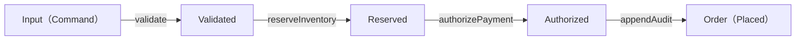

# 第2章: 合成の最小コア（対象・射・合成）

## 学習ゴール

- 対象＝状態/型/境界、射＝変換/操作、合成＝パイプラインとして説明できる
- 合成律（結合律・恒等射）が保守性に効く理由を説明できる
- 例題システムを Objects/Morphisms（最小テンプレ）に落とせる
- 射の契約（Pre/Post、失敗条件）を AI に守らせるための入力（Context Pack）を作れる

## 圏論コア（定義・直観・ミニ例）

圏（Category）は、最小限には次で定義できます。

- 対象（Object）: 要素（本書では「型/状態/境界」を代表させる）
- 射（Morphism）: 対象から対象への写像（本書では「操作/API/変換」を代表させる）
- 合成（Composition）: 射をつないで新しい射を作る（`g ∘ f`）
- 合成律（Laws）:
  - 結合律（Associativity）: `h ∘ (g ∘ f) = (h ∘ g) ∘ f`
  - 恒等射（Identity）: 任意の `f: A → B` に対して `f ∘ id_A = f` かつ `id_B ∘ f = f`

直観:

合成律は「実装の括弧の付け替え（リファクタ）をしても意味が変わらない」ための条件です。ソフトウェアでは、パイプライン/ユースケースの分割や統合、処理段階の抽象化を繰り返すため、合成律が成立する形で契約を固定すると保守性が上がります。

ミニ例:

`validate`（入力検証）、`reserveInventory`（在庫引当）、`authorizePayment`（決済承認）を順に適用する処理を考える。

- 結合律が成立していれば、実装上の構造として `(authorizePayment ∘ reserveInventory) ∘ validate` と `authorizePayment ∘ (reserveInventory ∘ validate)` を入れ替えても、結果（状態・副作用の意味）が一致する。
- 恒等射は「何もしない段階」を許し、共通処理・条件分岐の組み立てを単純化する（例: ある条件では `id` を挟んでパイプラインの形を揃える）。



## ソフトウェア設計への射影（どこに効くか）

本書では次の対応で設計成果物を作ります。

- 対象（Object）＝状態/型/境界:
  - `Order`（注文）や `Payment`（決済）などの主要なドメイン型
  - 状態遷移（例: Draft → Placed → Paid → Shipped）
  - 境界（例: Order/Payment/Inventory/Shipment/Audit の責務分離）
- 射（Morphism）＝変換/操作:
  - `CreateOrder`, `PlaceOrder`, `AuthorizePayment`, `ShipOrder` などのユースケース/API
  - 入力/出力、Pre/Post、失敗条件（failures）
- 合成（Composition）＝パイプライン:
  - ユースケースの連鎖（例: PlaceOrder → AuthorizePayment → ShipOrder）
  - 非同期/再試行を含む場合も「意味としての合成」をまず固定する（実装方式は後段で選ぶ）

重要なのは「AIに委任する前に、射の契約を固定する」ことです。契約が曖昧だと、AIは不足情報を補完してしまい、合成可能な部品（保守可能な境界）になりません。

## 設計成果物（テンプレ：表/図式/チェックリスト）

共通例題（注文処理）の Context Pack は次を参照します。

- [docs/examples/common-example/context-pack-v1.yaml](../../docs/examples/common-example/context-pack-v1.yaml)

ここでは、Objects/Morphisms の最小テンプレを示し、例題で一部を埋めます。

### Objects テンプレ（最小）

```yaml
objects:
  - id: <ObjectId>
    kind: entity # entity | value | event
    states: []
    fields: []
    note: "" # 任意（境界/権限/不変条件の補足など）
```

例（Order）:

```yaml
objects:
  - id: Order
    kind: entity
    states: [Draft, Placed, Paid, Shipped, Cancelled]
    fields: [orderId, items, totalAmount, state]
    note: "状態遷移の安全性（禁止遷移）を不変条件として後段で固定する"
```

### Morphisms テンプレ（最小）

```yaml
morphisms:
  - id: <MorphismId>
    input: {}
    output: {}
    pre: []
    post: []
    failures: []
```

例（PlaceOrder）:

```yaml
morphisms:
  - id: PlaceOrder
    input: { orderId: "OrderId" }
    output: { orderId: "OrderId" }
    pre:
      - "Order.state == Draft"
    post:
      - "Order.state == Placed"
      - "InventoryReservation が作成される（または更新される）"
      - "AuditEvent(\"PlaceOrder\") が記録される"
    failures:
      - NotFound
      - InvalidState
      - OutOfStock
```

## AIエージェントへの引き渡し

AIに実装を委任する場合、まず Morphisms を「契約」として固定し、AIが勝手に改変できないようにします。

最低限、次を Context Pack に含めます。

- Morphisms の Pre/Post/failures（契約）
- Non-goals（やらないこと）
- Forbidden changes（禁止事項）

プロンプト例（抜粋）:

> 入力の Context Pack に従って実装とテストを生成せよ。  
> Pre/Post/failures/Forbidden changes を変更してはいけない。  
> 不足情報があれば、補完せず質問せよ。仕様追加は禁止。

## 検証（テスト観点・可換性チェック）

本章では、射の契約（Pre/Post/failures）が守られていることを最優先で検証します。

- Pre 条件の検証: 前提を満たさない入力で failures が返ること
- Post 条件の検証: 正常系で状態/副作用（監査）まで含めて成立すること
- 合成の安全性: 合成された一連の操作でも、個々の Post が矛盾しないこと

可換図式（Diagrams）をテストへ落とす手順は[第3章](../chapter03/)で扱います。

## 演習

共通例題の Context Pack を参照し、次を実施します。

1. `Order`, `Payment`, `InventoryReservation`, `Shipment`, `AuditEvent` を Objects テンプレで整理する
2. `CreateOrder`, `PlaceOrder` を Morphisms テンプレで整理する（Pre/Post/failures を必ず書く）
3. 作成した Objects/Morphisms を AI に提示し、実装スケルトンと受入テスト案を生成させる
4. AIが契約（Pre/Post/failures）を勝手に変更していないかレビューする

## まとめ

- 対象＝状態/型/境界、射＝操作、合成＝パイプラインとして設計単位を揃える
- 合成律（結合律・恒等射）は、括弧の付け替え（リファクタ）を意味保存で行うための条件になる
- AI委任では、まず射の契約（Pre/Post/failures）と禁止事項（Forbidden changes）を固定する
