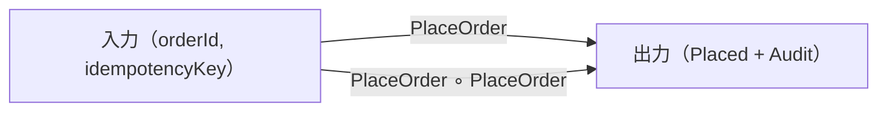

# 第3章: 図式と可換性（仕様をテスト可能にする）

## 学習ゴール

- 可換図式＝同値条件/整合条件として、不変条件を定義できる
- 図式（Diagrams）をテスト観点（単体/統合/プロパティ）へ変換できる
- AIに図式からテストを生成させる際の入力と禁止事項を定義できる
- 図式追加→テスト観点追加→CIで破綻検知、という運用ループを設計できる

## 圏論コア（定義・直観・ミニ例）

図式（Diagram）は、対象と射で表された「複数の経路」を持つ構造です。図式が可換（commutative）であるとは、異なる経路で得られる結果が一致することを意味します。

本書の射影では、可換性を次のように読み替えます。

- 可換図式＝同値条件/整合条件（不変条件）
  - 同じ入力に対して、実行経路や再試行の違いがあっても「意味として同じ結果」になる
  - 例: 冪等（idempotency）、正規化（normalization）、互換性（compatibility）、権限境界（authorization）

ミニ例（直観）:

同じ注文に対して `PlaceOrder` が重複実行されても、在庫引当が二重計上されない（冪等）。これは「射の繰り返しが、ある意味で恒等に近い振る舞いをする」という不変条件であり、図式（性質）として固定すると、実装方式（再試行/非同期/ロック戦略）が変わっても検証軸が揺れません。



## ソフトウェア設計への射影（どこに効くか）

AIによる実装・改稿・リファクタは、局所最適化が入りやすい。図式（Diagrams）を不変条件として固定すると、AIが生成した差分の正当性を「性質」で判定できます。

本書では、図式を次の用途に使います。

- 仕様の固定: 例示ではなく性質として「正しさ」を定義する
- テストの生成: 性質から検証項目（テスト観点）を導く
- レビューの基準: 差分が図式を壊していないかを確認する

可換図式として扱いやすい設計要件の例:

- 冪等（同一入力の重複が同じ結果に収束する）
- 正規化（正規化前後で観測可能な意味が変わらない）
- 互換性（旧API/新APIで観測結果が一致する）
- 権限境界（権限チェックが抜けない、越境できない）
- 監査整合（重要操作が必ず監査証跡を残す）

## 設計成果物（テンプレ：表/図式/チェックリスト）

共通例題（注文処理）の Diagrams は次にあります。

- [docs/examples/common-example/](../../docs/examples/common-example/)

### Diagrams テンプレ（最小）

```yaml
diagrams:
  - id: <DiagramId>
    statement: "<invariant statement>"
    verification: []
    counterexample: "" # 任意
```

例（監査整合）:

```yaml
diagrams:
  - id: D2-audit-consistency
    statement: "重要操作は必ず監査証跡を残す"
    verification:
      - "操作が成功した場合、対応するAuditEventが存在する"
      - "監査イベントのpayloadHashが改竄検知に使える"
```

### 図式→テスト観点への変換手順

1. 対象と射を特定する（どの Objects/Morphisms が関係するか）
2. 可換性の「観測点」を決める（状態、戻り値、イベント、監査、外部副作用）
3. テストの粒度を選ぶ
   - 単体（Unit）: 純粋な変換や判定、状態遷移の局所性
   - 統合（Integration）: 複数コンポーネント、監査/DB/キュー等を含む
   - プロパティ（Property）: 冪等性、同値性、順序の不変性など
4. 反例（壊れ方）を1つ用意し、失敗するテストとして固定する（回帰防止）

変換の成果物は「検証項目リスト（チェックリスト）」として残します。

## AIエージェントへの引き渡し

図式からテストを生成させる場合、AIが仕様を追加・変更しないように制約します。

入力（最低限）:

- Diagrams（id/statement/verification）
- 関係する Objects/Morphisms（用語解釈のぶれを防ぐ）
- Forbidden changes（仕様追加・契約改変の禁止）

AIプロンプト例（抜粋）:

> 次の Diagrams を満たすテスト観点を列挙し、各 Diagram id に紐づくテスト案を作成せよ。  
> 仕様追加は禁止。Diagrams/Objects/Morphisms/Pre/Post/failures を変更してはいけない。  
> 不足情報がある場合は補完せず質問せよ。  
> 出力は「Diagram id → テスト観点 → 期待結果」の形式で示せ。

## 検証（テスト観点・可換性チェック）

図式は「テストの生成規則」になり得ます。例えば次の対応が典型です。

- 冪等（D1）:
  - 同一入力を2回適用し、観測点（在庫引当、監査、状態）が収束すること
  - プロパティテスト/同一性検証が適用しやすい
- 監査整合（D2）:
  - 各重要操作の成功時に監査イベントが存在すること
  - 統合テストで担保しやすい
- 状態遷移安全性（D3）:
  - 禁止遷移が必ず失敗（InvalidState）になること
  - 単体テスト（状態機械）＋統合テストの併用が有効

重要なのは、図式を「自然言語の美文」で終わらせず、verification を検証可能な粒度へ落とすことです。

## 演習

### 演習1: 図式追加→テスト観点追加→CIで破綻検知

1. 共通例題の Context Pack に、図式を1つ追加する（例: CancelOrder の冪等性）
2. 追加した図式の verification を「検証項目リスト」として書く
3. AIに、図式 id ごとのテスト観点案を生成させる（仕様追加は禁止）
4. 追加内容がフォーマットとして破綻していないか、機械的に検出する
   - minimal lint: `python3 scripts/validate-context-pack.py docs/examples/common-example/context-pack-v1.yaml`
   - schema validation: `python3 scripts/validate-context-pack-schema.py docs/examples/common-example/context-pack-v1.yaml`
   - CI（book-formatter checks + Context Pack 検証: minimal lint + schema validation）で破綻が検出されることを確認する
   - （任意）ローカルでは `npm run qa` で CI 相当を一括実行できる

## まとめ

- 可換図式（Diagrams）を「同値条件/整合条件」として固定すると、正しさを性質として扱える
- 図式はテスト観点へ変換できる（単体/統合/プロパティ）
- AIには図式と禁止事項を入力し、仕様追加や契約改変を防ぐ
