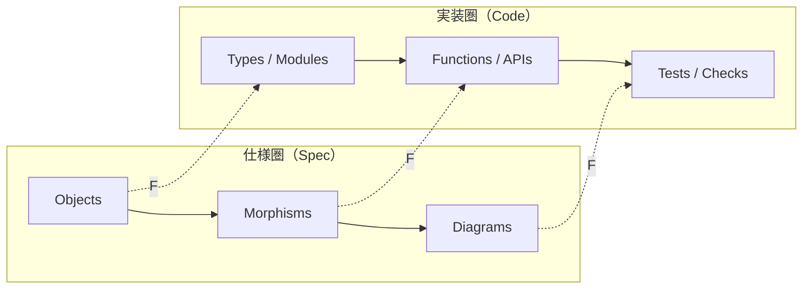

# 第4章: 関手（仕様→設計→実装の写像）

## 学習ゴール

- 関手＝構造保存（合成保存・恒等保存）として説明できる
- 仕様の分解（Objects/Morphisms/Diagrams）と実装の分解（モジュール境界）の対応を設計できる
- Context Pack に「保存すべき構造」（禁止事項/制約）を書ける
- AI生成物レビューで、関手性の破綻パターンを検知できる
- 仕様変更時に「どこまでAIに任せてよいか」を線引きできる

## 圏論コア（定義・直観・ミニ例）

関手（Functor）`F: C → D` は、圏 `C` の対象と射を、圏 `D` の対象と射へ写す写像です。重要なのは「構造保存」です。

- 対象の対応: `A ↦ F(A)`
- 射の対応: `f: A → B ↦ F(f): F(A) → F(B)`
- 合成保存: `F(g ∘ f) = F(g) ∘ F(f)`
- 恒等保存: `F(id_A) = id_{F(A)}`

直観:

「仕様の構造（対象/操作/合成）を、実装の構造（型/関数/モジュール）へ写すとき、合成や恒等といった“形”を壊さない」ことが、関手性です。関手性が壊れると、AIは局所最適化のつもりで境界や契約を破壊し、変更容易性が落ちます。

## ソフトウェア設計への射影（どこに効くか）

本書では、次の二つの「圏」を意識して設計成果物を作ります。

- 仕様圏（Spec）:
  - 対象: Objects（型/状態/境界）
  - 射: Morphisms（操作の契約: Pre/Post/failures）
  - 図式: Diagrams（不変条件）
- 実装圏（Code）:
  - 対象: 実装上の型/データ構造/モジュール境界
  - 射: 関数/メソッド/APIハンドラ/ジョブ

AI委任を関手として捉えると、次の設計判断がしやすくなります。

- モジュール境界の固定: 仕様圏の Objects を実装圏のモジュールへ写す（勝手に混ぜない）
- 合成の固定: 仕様圏の「操作の合成」を、実装の呼び出し順/依存関係へ写す（勝手に並べ替えない）
- 恒等の固定: 「何もしない」ことが意味を持つ箇所（監査、権限、再試行）で、暗黙の副作用を入れない

仕様変更時の線引き（例）:

- AIに任せやすい:
  - 新しい Morphism の追加（既存Objects/Diagramsを不変とし、契約が明確）
  - 既存実装の整形・性能改善（Diagrams/Forbidden changes を満たす範囲）
- 人間が再設計すべき:
  - Objects の境界変更（責務や所有権の変更）
  - Diagrams（不変条件）の変更（正しさの定義が変わる）
  - 失敗条件/権限/監査の変更（運用・責任の変更）

## 設計成果物（テンプレ：表/図式/チェックリスト）

関手性を保つために、Context Pack に「保存すべき構造」を明示します。

### 保存すべき構造（テンプレ）

- 境界:
  - Objects と所有権（どのモジュールが何を所有するか）
  - 越境規則（どこからどこを呼べるか）
- 契約:
  - Morphisms の Pre/Post/failures（変更禁止）
  - エラー分類（追加/統合の方針）
- 正しさ:
  - Diagrams（不変条件、変更禁止）
  - Acceptance tests（最低限のDoD）
- 制約:
  - セキュリティ/監査/性能/運用
- 禁止事項:
  - 依存追加の禁止、公開API互換性、境界の無断変更など

### 関手性レビューのチェックリスト（抜粋）

- 合成保存:
  - 仕様の操作順・依存関係が、実装で勝手に入れ替わっていないか
- 恒等保存:
  - 「何もしない」前提の箇所に副作用が紛れ込んでいないか（監査/メトリクス/外部呼び出し等）
- 対象の対応:
  - 仕様上の Object が、実装で曖昧な“汎用DTO”に潰されていないか
- 契約の保持:
  - Pre/Post/failures が暗黙に変化していないか（例外型、戻り値、状態遷移）

## AIエージェントへの引き渡し

AIへ引き渡す際は「保存すべき構造」を禁止事項として具体化し、逸脱を抑制します。

入力（最低限）:

- Objects/Morphisms/Diagrams（仕様圏）
- Coding conventions（実装圏の置き場）
- Forbidden changes（保存すべき構造）

プロンプト例（抜粋）:

> 以下の Context Pack を仕様とする。Objects/Morphisms/Diagrams/Forbidden changes を変更してはいけない。  
> 実装は、Objects をモジュール境界として尊重し、Morphism ごとに対応する実装単位（関数/API）を作れ。  
> 操作の合成（呼び出し順）を勝手に変更しない。不足情報があれば補完せず質問せよ。

## 検証（テスト観点・可換性チェック）

関手性は「設計成果物と実装の対応が保たれているか」という観点で検証します。

- 変更差分レビュー:
  - Objects に対応するモジュール境界が維持されているか
  - Morphisms の契約（Pre/Post/failures）が維持されているか
- テスト:
  - Acceptance tests（最小DoD）が維持されているか
  - Diagrams（不変条件）が維持されているか（具体化は第3章）

## 演習

### 演習1: 仕様変更の線引き

共通例題を前提に、次を実施します。

1. 「Morphismの追加」と「Object境界の変更」を1つずつ想定し、AIに任せる範囲を線引きする
   - 例（追加）: `CancelOrder` を追加（既存 Diagrams を維持）
   - 例（変更）: `Payment` 境界を `Order` へ統合（境界変更）
2. それぞれについて、Context Pack の Forbidden changes と Constraints をどう書くべきか整理し、Context Pack を更新する
3. Context Pack を更新したら検証する（編集対象に合わせてパスを置き換える）
   - （初回のみ）`python3 -m pip install -r scripts/requirements-qa.txt`
   - minimal lint: `python3 scripts/validate-context-pack.py <your-context-pack.yaml>`（例: `docs/examples/common-example/context-pack-v1.yaml`）
   - schema validation: `python3 scripts/validate-context-pack-schema.py <your-context-pack.yaml>`（例: `docs/examples/common-example/context-pack-v1.yaml`）
   - （任意）CI相当の一括チェック: `npm run qa`
   - 検証コマンドのSSOT: [Context Pack v1 仕様（検証コマンド）]({{ '/docs/spec/context-pack-v1/#validation-commands' | relative_url }})
4. AIに実装を委任する場合のレビュー観点（関手性チェックリスト）を列挙する

## まとめ

- 関手は「仕様→実装の構造保存写像」として、AI委任の逸脱検知に使える
- Context Pack に「保存すべき構造」（境界/契約/不変条件/禁止事項）を書くことで関手性を保ちやすくなる
- 仕様変更時は、Objects/Diagrams の変更を人間が握り、Morphisms追加や局所改善をAIへ委任する、という線引きが有効
