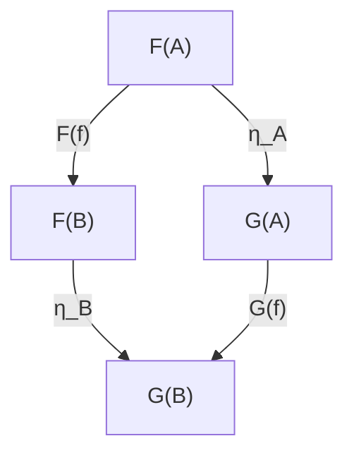

# 第5章: 自然変換（差分・リファクタを意味保存で扱う）

差分は小さく見えても、
意味保存の説明がなければ安全な変更とは言えません。
第5章では、Before / After を
自然変換の観点で読み替えます。

本章の見せ場は、Before / After + 可換チェックのテンプレです。
レビューで「何が保存され、どこが変わったか」を一枚で説明できます。

## 学習ゴール

- 自然変換＝対象ごとの成分が整合する「全体の置換」として説明できる
- AIに改修・リファクタを委任する際の安全柵（自然性＝可換条件）を設計できる
- Before/After + 可換チェック（影響範囲、互換性）テンプレで差分を記述できる
- AI改修を「意味保存」でレビューできる

## 圏論コア（定義・直観・ミニ例）

自然変換（Natural Transformation）は、2つの関手 `F, G: C → D` のあいだの「関手の変換」です。

- 各対象 `A` に対して成分 `η_A: F(A) → G(A)` を持つ
- 自然性（Naturality）: 任意の射 `f: A → B` について次が可換
  - `G(f) ∘ η_A = η_B ∘ F(f)`



直観を示します。

対象ごとに「古い表現→新しい表現」への変換（成分）を用意し、その変換が全ての操作（射）と矛盾しないことを要求します。
これにより、「構造を変えても意味を保つ」リファクタを条件として固定できます。

ミニ例（直観）を示します。

`Order` の表現を変更したときは、フィールド名変更や状態表現の変更が起こり得ます。
その場合でも `PlaceOrder` や `ShipOrder` が “同じ意味” を持つように、入力/出力/監査の対応を成分 `η` で定義し、各操作との可換性で検証します。

## ソフトウェア設計への射影（どこに効くか）

AIにリファクタを任せると、コードの見た目は良くなるが意味が壊れる、という事故が起きやすい。自然変換として捉えると、改修を「意味保存の差分」として評価できます。

本書での読み替えを示します。

- 関手 `F`: Before（改修前）の設計/実装の写像
- 関手 `G`: After（改修後）の設計/実装の写像
- 自然変換 `η`: 対象ごとの対応（変換）＋可換条件（操作と整合すること）

自然性が破れる典型を示します。

- ある対象では変換できるが、別の対象では意味がずれる（部分最適化）
- 操作の前後で、変換の位置が変わると結果が一致しない（可換性が壊れる）
- 互換性（API/永続化/監査）を暗黙に破壊する

## 設計成果物（テンプレ：表/図式/チェックリスト）

### Before/After + 可換チェック（テンプレ）

| 項目 | 内容 |
| --- | --- |
| 目的 | 何を改善するか（保守性/性能/可読性など） |
| 非目的 | 何を変えないか（仕様追加の禁止等） |
| 影響範囲 | 対象（Objects）/操作（Morphisms）/不変条件（Diagrams） |
| Before | 変更前の前提（契約、モデル、エラー等） |
| After | 変更後の前提（契約、モデル、エラー等） |
| 成分（対応） | 対象ごとの変換 `η_A`（例: DTO変換、移行、互換レイヤ） |
| 可換チェック | 各操作 `f` に対して `G(f) ∘ η_A = η_B ∘ F(f)` を検証する観点 |
| 互換性 | API/データ/監査/権限の互換性 |
| 禁止事項 | Forbidden changes（不変条件や境界の無断変更など） |

実務では、可換チェックは「観測点」を明確にします。

- 戻り値（APIレスポンス）
- 永続化状態（DB）
- 監査ログ（AuditEvent）
- 外部副作用（決済/配送など）

## 第5章補論: 自然変換から Lens / Optic へ

自然変換は、Before と After の対応がすべての操作と整合するかを確認する枠組みです。
一方、Lens / Optic は、source と view のあいだで「読む」だけでなく、許可された更新を source へ戻す関係を明示します。
実務では、UI mapper の便利な比喩で終わらせず、`get` / `put` / `laws` / `forbidden_updates` をレビュー対象にします。

| 観点 | 自然変換 | Lens / Optic |
| --- | --- | --- |
| 主な問い | Before / After の差分は意味保存か | view への更新を source へ安全に戻せるか |
| 固定するもの | 対象ごとの成分と可換条件 | `get`、`put`、laws、禁止更新 |
| 実務例 | リファクタ、互換レイヤ、データ移行 | DTO、read model、UI 編集、設定画面 |
| 破綻例 | 操作前後で結果が一致しない | view から監査履歴や決済承認を直接書き換える |

代表的な読み方は次の通りです。

- `get`: source から view を作る。例: `Order` から `OrderSummaryDTO` を作る。
- `put`: view で許可された変更だけを source へ戻す。
- laws: `get` と `put` が不要な差分を生まないことを確認する規則。
- `forbidden_updates`: view から直接変えてはいけない source 側の事実。

Context Pack v2 では、次のように `views.lenses_or_optics` へ落とします。

```yaml
views:
  lenses_or_optics:
    - id: OrderSummaryView
      source: Order
      view: OrderSummaryDTO
      get:
        description: "Order から UI 表示用 DTO を作る"
      put:
        description: "UI/API から許可された配送先メモと表示名だけを Order へ戻す"
        allowed_updates:
          - displayName
          - shippingMemo
      laws:
        - get_after_put_consistency
        - put_after_get_no_spurious_change
      forbidden_updates:
        - change_payment_authorization_directly
        - mutate_audit_history
```

ここで重要なのは、`put` を「何でも戻せる setter」として扱わないことです。
`OrderSummaryDTO` の編集から `Payment.status` や `AuditEvent` を直接変更できるなら、source / view の境界が壊れています。
レビューでは、`allowed_updates` と `forbidden_updates` を分け、`laws` を acceptance test や property-based test の観点へ落とします。

Optic の圏論的定式化には profunctor optics などの研究導線があります。
本書では、詳細な定式化ではなく、[参考文献（Optics / Lenses / Categorical Cybernetics）]({{ '/appendices/references/' | relative_url }}#ref-optics-lenses-categorical-cybernetics)に一次導線を残し、設計レビューで確認できる条件へ限定します。

## AIエージェントへの引き渡し

AIにリファクタを委任する場合は、自然性を満たすための安全柵を入力として与えます。

入力（最低限）は次のとおりです。

- 変更の目的/非目的
- 影響範囲（Objects/Morphisms/Diagrams）
- Before/After の差分説明
- 禁止事項（Forbidden changes）
- 可換チェック（テスト観点）

プロンプト例（抜粋）を示します。

> 次の Before/After と可換チェックに従ってリファクタせよ。  
> 仕様追加は禁止。Pre/Post/failures/Diagrams/Forbidden changes を変更してはいけない。  
> 各 Morphism について「自然性（可換条件）が成り立つこと」を示すテスト観点を作り、差分に含めよ。

## 検証（テスト観点・可換性チェック）

自然性（可換条件）は、改修前後の振る舞いが一致することを、操作ごとに検証する規則です。代表的な検証方法は次の通りです。

- ゴールデン（[Approval]({{ '/glossary/' | relative_url }}#approval)）テスト:
  - Before の出力を保存し、After で一致を確認する
- 契約テスト:
  - Pre/Post/failures が同一であることを検証する
- 図式由来テスト:
  - 既存 Diagrams を壊していないことを検証する（[第3章](../chapter03/)の手順）

レビューでは「差分説明」と「可換チェック（テスト観点）」がセットになっていることを必須とします。

## 演習

### 演習1: 差分説明→可換チェック→CIで検証

共通例題を前提に、次を実施します。

1. 変更を1つだけ決める（例: `AuditEvent` のフィールド追加、エラー分類の整理）
2. Before/After テンプレで差分説明を書く
3. 対象ごとの成分（対応）と、操作ごとの可換チェック（テスト観点）を列挙する
4. 破綻検知（最低限）を行う。
   - Context Pack を変更した場合は `minimal lint` を実行する。
     - `python3 scripts/validate-context-pack.py docs/examples/common-example/context-pack-v1.yaml`
     - 対象: [共通例題: 注文処理]({{ '/examples/common-example/' | relative_url }})
     - 実行手順の正本: [Context Pack v1 仕様（検証コマンド）]({{ '/spec/context-pack-v1/' | relative_url }}#validation-commands)
   - Context Pack を変更した場合は `schema validation` を実行する。
     - `python3 scripts/validate-context-pack-schema.py docs/examples/common-example/context-pack-v1.yaml`
   - CI（book-formatter checks + Context Pack 検証: minimal lint + schema validation）で破綻が検出されることを確認する。
   - （任意）ローカルでは `npm run qa` で CI 相当を一括実行できる。
   - 注記: `docs/examples/common-example/context-pack-v1.yaml` のような repository 内パスは local 検証用の例です。reader-facing な内容確認は公開ページの [共通例題: 注文処理]({{ '/examples/common-example/' | relative_url }}) を正本として参照します。

## まとめ

- 自然変換は「差分を意味保存として扱う」ための枠組み（対象ごとの対応＋可換条件）
- AIリファクタでは、Before/After と可換チェック（テスト観点）を入力として固定し、仕様追加や契約改変を抑制する
- レビューは「差分説明」と「可換チェック（テスト観点）」を基準に行う

### 次章への接続

- 第6章では、ここで扱った意味保存の観点を前提に、契約そのものを最小標準形へ整える。
