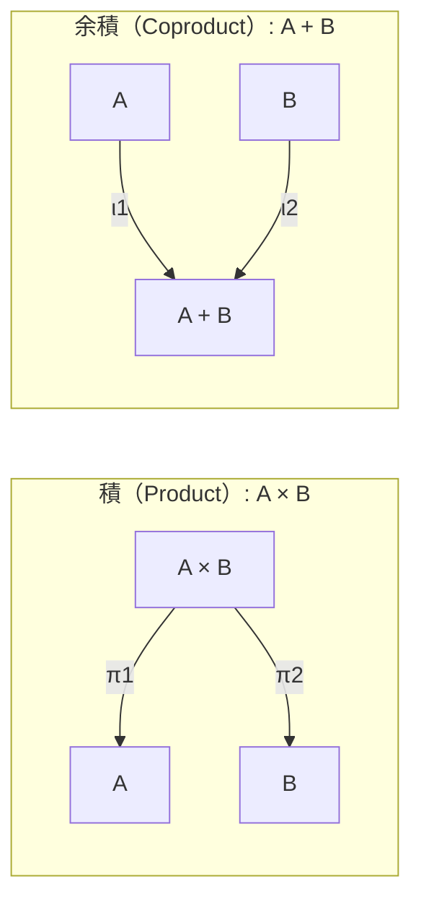

# 第6章: 普遍性（積・余積）で標準化する契約

## 学習ゴール

- 積＝AND（情報の束）、余積＝OR（分岐/Union/エラー合成）として説明できる
- 成功/失敗を余積（sum type）として設計し、テスト設計へ接続できる
- AIに「最小の契約」を設計させる指示（入力・禁止事項）を書ける
- 例題（注文処理）で DTO/API/ドメイン型を標準形に落とせる
- インターフェース肥大化を抑える設計ルールを得られる

## 圏論コア（定義・直観・ミニ例）

普遍性（universal property）は「標準形」を与える考え方です。本章では積（product）と余積（coproduct）を、契約設計の標準形として用います。

- 積（Product）: `A × B`
  - 直観: AND（両方の情報を同時に持つ束）
  - 例: 入力が「`orderId` と `actor` を必ず持つ」なら、それは積として束ねられる
- 余積（Coproduct）: `A + B`
  - 直観: OR（どちらか一方の分岐、識別子付きUnion）
  - 例: 結果が「成功」または「エラー」なら、それは余積として表現できる（`Result<Success, Error>`）



ミニ例（直観）:

「必要な情報」を積で組み立て、「分岐（成功/失敗、複数ケース）」を余積で表現する。これにより、巨大なDTO（多数の optional を含む）を避け、AIが実装/テストを生成しやすい契約になる。

## ソフトウェア設計への射影（どこに効くか）

### 積＝AND（情報の束）

契約（入力/出力）が肥大化する典型は「何でも入るDTO」に収束することです。積として設計すると、契約は次の性質を持ちます。

- 必須情報が明確（AND）
- 合成しやすい（小さい部品を束ねて拡張できる）
- テストしやすい（欠落ケースが明示される）

アンチパターン:

- `PlaceOrderRequest` に多数の optional フィールドがある（実行経路が暗黙分岐する）
- 「どれが必須か」が人間にもAIにも曖昧になる

設計ルール（積）:

- optional を増やして「万能入力」にしない
- 代わりに、入力のケース分岐は余積（Union）に寄せる

### 余積＝OR（分岐/Union/エラー合成）

成功/失敗は余積として設計できます。

- `Result<Success, Error>`（成功 + エラー）
- `Error = NotFound + InvalidState + OutOfStock + ...`（エラーの余積）

エラー設計とテスト設計の接続:

- エラーの余積を列挙すると、テスト観点が自動的に得られる（各 variant がテストケース）
- 例: `OutOfStock` を追加したら、それを起こす入力・期待結果（failures）が必ず増える

### 例題での適用（DTO/API/ドメイン型）

共通例題（注文処理）の Morphisms（例: `PlaceOrder`）を、次の形へ正規化します。

- 入力: 積（必要情報の束）
- 出力: 成功/失敗の余積（Result）
- 失敗: エラーの余積（variant 列挙）

## 設計成果物（テンプレ：表/図式/チェックリスト）

参照:

- 共通例題 Context Pack: `docs/examples/common-example/context-pack-v1.yaml`

### 契約テンプレ（最小）

| 要素 | 推奨表現 |
| --- | --- |
| 入力 | 積（必須情報のみを束ねる） |
| 出力 | 余積（Success + Error） |
| エラー | 余積（variant列挙） |
| テスト | variantごとに最小1ケース + 図式（Diagrams）由来の性質 |

例（PlaceOrder の正規形イメージ）:

```yaml
input:
  orderId: OrderId
  actor: ActorId
  idempotencyKey: IdempotencyKey
output:
  kind: Result
  ok: { orderId: OrderId }
  err:
    - NotFound
    - InvalidState
    - OutOfStock
```

インターフェース肥大化を抑えるルール:

- 入力に optional を足す前に「case分岐（余積）」で表現できないか検討する
- エラーは variant を列挙し、failures とテスト観点をセットで更新する
- 「最小の契約」で Post（事後条件）を満たせるかを基準にする（余計な情報は要求しない）

## AIエージェントへの引き渡し

AIに「最小の契約」を設計させる場合、普遍性の観点（積/余積）で制約を与えます。

入力（最低限）:

- Goals/Non-goals
- Objects/Morphisms（Pre/Post/failures）
- Diagrams（不変条件）
- Forbidden changes（契約改変・仕様追加の禁止）

指示の書き方（抜粋）:

> 入力と出力を「積（必須情報）」と「余積（成功/失敗）」として設計せよ。  
> optional を増やして万能DTOにしてはいけない。分岐は余積（Union）で表現せよ。  
> failures（エラーvariant）を列挙し、variantごとのテスト観点を必ず出力せよ。  
> 仕様追加は禁止。不足情報があれば補完せず質問せよ。

## 検証（テスト観点・可換性チェック）

本章では次の検証が最小セットです。

- エラー余積（variant）ごとの検証:
  - 各 variant を発生させる入力
  - 期待するエラー（型/コード/メッセージ）と副作用（監査）
- 入力積（必須情報）の検証:
  - 欠落時に failures（ValidationError 等）になること
- 余積（Success/Error）の整合:
  - Success のとき Post が成立し、Error のとき副作用が矛盾しないこと

## 演習

共通例題を前提に、契約の正規化を行います。

1. `PlaceOrder` の入力/出力/エラーを、積/余積として再設計する（テンプレに落とす）
2. エラーvariantごとのテスト観点を列挙する（最低1ケースずつ）
3. AIに「最小の契約」を再設計させ、万能DTOに逃げていないかレビューする
4. Context Pack を更新した場合は `python3 scripts/validate-context-pack.py docs/examples/common-example/context-pack-v1.yaml` を通す

## まとめ

- 積＝AND（必須情報の束）、余積＝OR（分岐/Union/成功・失敗）として契約を標準形へ落とす
- 成功/失敗とエラーvariantを余積で列挙すると、テスト観点が自動的に得られる
- AIには「optionalを増やさない」「分岐は余積で表す」「variantごとのテスト観点を出す」を明示して委任する
