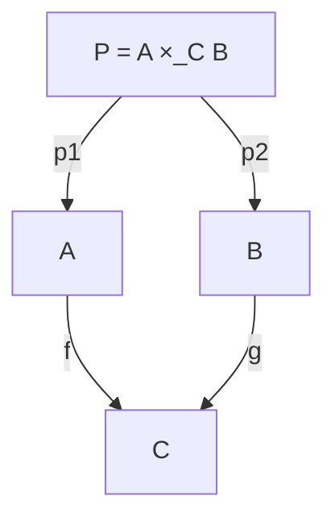
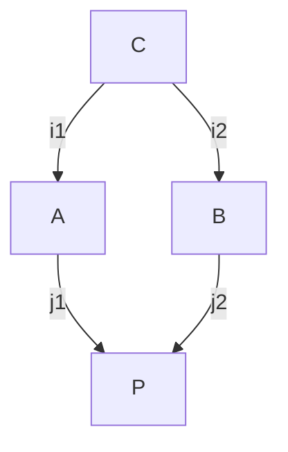

# 第7章: Pullback/Pushout（統合・移行の設計パターン）

## 学習ゴール

- Pullback（整合のある結合）/ Pushout（共通インターフェースでの接着）の直観を説明できる
- スキーマ統合、サービス統合、認証統合、移行（旧→新）を図式として設計できる
- 図式としての統合条件を、テスト項目（差分/互換）へ変換できる
- 例題（Order/Payment等）で統合点の設計成果物を作れる
- “統合で壊れる”を事前に図式で表現できる

## 圏論コア（定義・直観・ミニ例）

統合（結合・移行）は「二つのものを同時に満たす」「共通部分で貼り合わせる」といった構造を持ちます。本章では、その標準形として Pullback と Pushout の直観を使います。

### Pullback（整合のある結合）

二つの対象 `A`, `B` を、共通の対象 `C` への対応（写像）を揃えたまま結合する構造です。

直観:

`A` と `B` は独立だが、`C` に対応する部分は一致していなければならない。Pullback は「一致条件（整合性）」を保った結合を表現します。

### Pushout（共通インターフェースでの接着）

共通部分 `C` を介して、`A` と `B` を貼り合わせて新しい対象 `P` を作る構造です。

直観:

`C`（共通インターフェース/共通スキーマ/共通認証）を基準に、`A` と `B` を接着する。移行や統合APIの設計で頻出します。

## ソフトウェア設計への射影（どこに効くか）

統合点で壊れる典型は「どこが同一で、どこが差分か」が曖昧なまま接着してしまうことです。Pullback/Pushout を図式として書くことで、統合条件（同値条件/互換条件）を先に固定できます。

代表ケース:

- スキーマ統合:
  - 旧DBと新DBを共通キー（例: `orderId`）で整合させつつ統合する（Pullback）
- サービス統合:
  - 旧APIと新APIを共通インターフェースで接着し、クライアント互換を保つ（Pushout）
- 認証統合:
  - 複数IdPの subject を共通の主体（Principal）へ写して整合させる（Pullback）
- 移行（旧→新）:
  - 旧データと新データが共通の正規形（Canonical）へ写したとき一致する（Pullback）

統合条件は「図式としての可換条件」なので、第3章の手順でテスト項目へ変換できます（差分/互換テスト、リコンシリエーション、契約テスト）。

## 設計成果物（テンプレ：表/図式/チェックリスト）

共通例題（注文処理）では、境界（Order/Payment/Inventory/Shipment/Audit）の統合点が複数あります。統合を行う場合は、少なくとも次を成果物として固定します。

### 統合点テンプレ（最小）

| 要素 | 内容 |
| --- | --- |
| 対象 | 統合対象（旧/新、A/B） |
| 共通基準 | 共通キー/共通正規形/共通インターフェース（C） |
| 写像 | 旧→C、新→C（またはC→旧/C→新） |
| 図式（統合条件） | 可換条件（同じものとして扱う条件） |
| 検証 | 差分/互換テスト、リコンシリエーション、監査 |

### 図式→テスト項目（差分/互換）への変換

- Pullback（整合結合）:
  - 同じ `C` へ写るはずのものが一致することを検証する（差分ゼロ、許容差の定義）
- Pushout（接着）:
  - 共通インターフェースを通る経路で、旧/新の観測結果が一致することを検証する（互換テスト）

## AIエージェントへの引き渡し

統合・移行は、AIが局所的に“つなぐ”と破綻しやすい領域です。AIへ委任する場合は、統合条件（図式）と検証項目を先に入力します。

指示の書き方（抜粋）:

> Pullback/Pushout の統合条件（Diagrams）を満たすように実装/テストを生成せよ。  
> 互換性（旧/新）を破壊する仕様追加は禁止。写像（旧→C、新→C）を勝手に変えてはいけない。  
> 差分/互換テスト項目を Diagram id に紐づけて出力せよ。

## 検証（テスト観点・可換性チェック）

統合の検証は「一致条件を観測可能にする」ことが中心です。

- 差分検証（Diff）:
  - Pullback の一致条件（旧→C と 新→C が一致）を検証する
- 互換検証（Compatibility）:
  - Pushout の共通インターフェース経由で旧/新が同じ観測結果になることを検証する
- 監査:
  - 統合・移行操作が監査証跡を残す（D2のような図式）

## 演習

1. 統合ケースを1つ選ぶ（例: `Payment` を外部サービスに切り出す/統合する）
2. 共通基準 `C`（正規形または共通インターフェース）を定義する
3. 図式（Pullback/Pushout）の統合条件を Context Pack の Diagrams として記述する
4. Context Pack を更新したら検証する（編集対象に合わせてパスを置き換える）
   - （初回のみ）`python3 -m pip install -r scripts/requirements-qa.txt`
   - minimal lint: `python3 scripts/validate-context-pack.py <your-context-pack.yaml>`（例: `docs/examples/common-example/context-pack-v1.yaml`）
   - schema validation: `python3 scripts/validate-context-pack-schema.py <your-context-pack.yaml>`
   - （任意）CI相当の一括チェック: `npm run qa`
   - 検証コマンドのSSOT: `docs/spec/context-pack-v1.md` の「検証コマンド」
5. 図式→テスト項目（差分/互換）へ変換し、検証項目リストとして残す

## まとめ

- Pullback は「整合条件を保った結合」、Pushout は「共通基準での接着」として統合を表現できる
- 統合条件を図式（Diagrams）として固定し、差分/互換テストへ変換することで、統合で壊れる要因を先に封じられる
