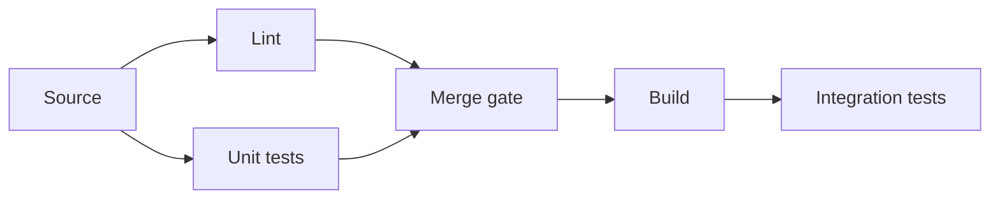

# 第8章: モノイダル圏とストリング図式（分業と配線）

分業は人数やエージェント数を増やすほど速くなりますが、
配線を設計しないと破綻します。
第8章では、逐次と並列の合成規則を
ストリング図式として可視化します。

本章の見せ場は、この章で紹介する CI 配線図とエージェント分割テンプレです。
誰が何を受け取り、どこで合流して品質を判定するかを先に固められます。

## 学習ゴール

- 逐次合成（`∘`）と並列合成（`⊗`）の区別を説明できる
- ストリング図式で接続点・合流点（配線）を可視化できる
- マルチエージェント分業を、入出力と合成規則としてテンプレ化できる
- 例題（CIパイプライン、並列テスト、非同期処理）へ適用できる
- 複数AIエージェントの協調を「設計」として管理できる

## 圏論コア（定義・直観・ミニ例）

モノイダル圏（Monoidal category）は、並列合成（テンソル）`⊗` を持つ構造です。ここでは厳密性よりも、分業と配線の直観に必要な部分だけを使います。

- 逐次合成（`∘`）: 前後関係がある処理の連鎖（パイプライン）
- 並列合成（`⊗`）: 独立な処理の並列実行と結果の合成（配線）
- 単位元（`I`）: 並列合成における空の入力/出力（扱いを統一するための概念）

ストリング図式（String diagram）は、対象（データ/成果物）を“線”、射（処理）を“箱”として描き、逐次/並列の接続を可視化します。ソフトウェアでは、データフロー、パイプライン、エージェント間の成果物受け渡しを設計成果物として固定するのに使えます。

## ソフトウェア設計への射影（どこに効くか）

AIエージェントを複数使うと、並列化はできるが破綻しやすい。原因は「入出力の契約」「合成規則」「競合解消」が設計されていないことです。

本章では、マルチエージェント協調を次の形で固定します。

- 役割分割: 何を作るエージェントか（責務）
- 入力/出力: 受け取る成果物、出す成果物（Context Pack、差分、テスト、レビュー結果など）
- 合成規則: 逐次（`∘`）か並列（`⊗`）か、合流点で何を正とするか
- 禁止事項: 互いの境界を壊さない、仕様追加しない、など

例（CIパイプラインの直観）は次のとおりです。

- `Lint ⊗ UnitTest` を並列に走らせ、両方が成功したら `Build` へ進む（合流）
- これは「並列合成→逐次合成」の配線として扱える

## 設計成果物（テンプレ：表/図式/チェックリスト）

### エージェント分割テンプレ（最小）

| 項目 | 内容 |
| --- | --- |
| Agent | 名前 |
| 役割 | 何を作るか（例: 実装、テスト、レビュー） |
| 入力 | Context Pack / 既存コード / 制約 / Forbidden changes |
| 出力 | PR、テスト、レポート、レビューコメント |
| 合成規則 | 逐次（`∘`）/並列（`⊗`）、合流時の優先順位 |
| 禁止事項 | 仕様追加、境界変更、依存追加など |

### ストリング図式（簡易表現）

CI の例（概念図）は次のとおりです。



同じ構造をマルチエージェントに適用する場合は、`Lint/Unit tests` を「独立な作業（⊗）」として割り当てます。
合流点（[Merge gate]({{ '/glossary/' | relative_url }}#merge-gate)）では、品質ゲートを満たした成果物だけを次へ渡します。


## 第8章補論: 境界を持つコンポーネントの合成

通常の string diagram は、部品同士の接続を視覚化します。
実務ではそれに加えて、「どこまでが部品の内部で、どこが外部へ公開される境界か」を固定する必要があります。
Structured cospans / open systems の見方は、この境界を明示したまま部品を合成するための補助線です。

本書では、double category の形式証明には踏み込みません。
次の4つを設計成果物に落とすために使います。

| 見方 | 第8章で固定するもの | 実務での確認点 |
| --- | --- | --- |
| String diagram | 部品の接続と合流点 | 入出力がつながっているか |
| Open system | 内部実装と外部境界の分離 | 外部API、DB、監査境界を混ぜていないか |
| Structured cospan | 境界を持つ部品の合成 | 共有インターフェースで合成しているか |
| Pushout | 共有境界の同一視 | 同一視したキーやイベントが検証できるか |

第7章の Pushout は「共通インターフェースでの接着」を扱いました。
第8章では、その直観を分業・配線に引き継ぎ、部品の境界を明示したまま合成します。
たとえば `OrderService` と `PaymentAdapter` をつなぐ場合、共有境界は `OrderId` と `PaymentRequestId` です。
境界を明示しないまま実装すると、支払取消要求だけが孤立したり、監査イベントが失われたりします。

Context Pack v2 では、この情報を `open_systems` に残します。
`components` は境界を持つ部品、`boundaries` は共有インターフェース、`composition` は合成方法と検証条件です。

```yaml
open_systems:
  components:
    - id: PaymentAdapter
      boundary_in:
        - AuthorizePayment
      boundary_out:
        - PaymentAuthorized
        - PaymentRejected
      internal_effects:
        - ExternalAPI
        - Retry
        - Audit
    - id: OrderService
      boundary_in:
        - CancelOrderCommand
      boundary_out:
        - OrderCancelled
        - PaymentCancelRequested
  boundaries:
    - id: PaymentSharedBoundary
      shared_interface:
        - OrderId
        - PaymentRequestId
      rule: "OrderId と PaymentRequestId だけを共有境界として合成する"
  composition:
    - id: OrderPaymentComposition
      shared_boundary:
        - OrderId
        - PaymentRequestId
      method: compose_by_shared_interface
      expected_property:
        - no_orphan_payment_request
        - audit_event_preserved
```

この例で重要なのは、`PaymentAdapter` の内部効果を `OrderService` に漏らさないことです。
`OrderService` は支払取消を要求しますが、外部決済APIのretryや監査の詳細は `PaymentAdapter` 側の境界内に閉じ込めます。
合成後の正しさは、「圏論的に合成したから正しい」ではなく、`no_orphan_payment_request` や `audit_event_preserved` のような検証条件で確認します。

### Lens / Optic と feedback loop

Lens / Optic は、第8章の配線図式では feedback loop を説明する補助線になります。
`get` は source から agent が観測する view を作り、`put` は agent / UI が許可された差分だけを source へ戻します。
agent loop へ接続する場合も、更新経路を自由な setter として扱わず、loop の戻り口に `laws` と `forbidden_updates` を置きます。

| loop の段階 | Lens / Optic で固定するもの | 検証観点 |
| --- | --- | --- |
| observe | `get` が作る view | 表示用 DTO が source の監査・権限条件を落としていないか |
| decide | view 上の許可更新 | agent が `forbidden_updates` を提案していないか |
| act / update | `put` が source へ戻す差分 | `get_after_put_consistency` と監査追跡が保たれるか |

Categorical cybernetics は、optimization や control を optics などの道具で扱う発展的な研究導線です。
本書では強化学習や制御理論の詳細へ踏み込まず、agent loop の観測・更新境界を Context Pack の検証条件として書く用途に限定します。

## 実装カタログへの接続

配線や分業を実装・研究カタログへ接続する場合は、[付録E: Applied Category Theory 実装カタログ]({{ '/appendices/implementation-catalog/' | relative_url }}) を参照します。

| 候補 | 第8章での使いどころ | 注意点 |
| --- | --- | --- |
| Catlab.jl | wiring diagram / string diagram / monoidal modeling を計算可能な構造として試す | proof assistant ではない。形式的に検証可能な proof を生成するとは書かない |
| GATlab | generalized algebraic theories による語彙・interface 定義を考える | 研究導線として扱い、採用前に論文と実装状況を確認する |
| CatColab | 共同で conceptual model を作り、批評・共有する | maturity、権限、データ感度、公開範囲を先に確認する |

この表は「すぐ導入するツール一覧」ではありません。第8章の設計成果物に戻すための参照地図です。

## AIエージェントへの引き渡し

マルチエージェント運用では、各エージェントに「自分の入出力」と「合成規則」を明示します。

指示の書き方（抜粋）は次のとおりです。

> あなたの入力はX、出力はYである。Y以外を変更してはいけない。  
> Forbidden changes を守り、仕様追加は禁止。  
> 並列作業（⊗）の前提として、他エージェントの成果物に依存しないこと。  
> 合流点では、CIレポートとレビュー指摘を優先し、差分を最小化せよ。

## 検証（テスト観点・可換性チェック）

検証は「合流点」を基準に設計します。

- 各エージェントの出力が契約（入力/出力/禁止事項）を満たす
- 合流点で品質ゲート（CI、Diagrams、Acceptance tests）を満たす
- 逐次合成（`∘`）において、後段が前段の出力を前提通りに解釈できる

## 演習

1. 作業を3〜4エージェントに分割する（例: 設計成果物、実装、テスト、レビュー）
2. 各エージェントの入出力と合成規則（逐次/並列）をテンプレで記述する
3. 合流点の品質ゲート（CI/レビュー/Diagrams）を定義する

## まとめ

- 逐次合成（`∘`）と並列合成（`⊗`）を区別して設計すると、分業と配線が破綻しにくい
- ストリング図式は、接続点・合流点を可視化し、マルチエージェント協調を設計成果物として固定できる

### 次章への接続

- 第9章では、ここで分けた作業単位の内側にある効果境界を、pure core / impure shell として固定する。
