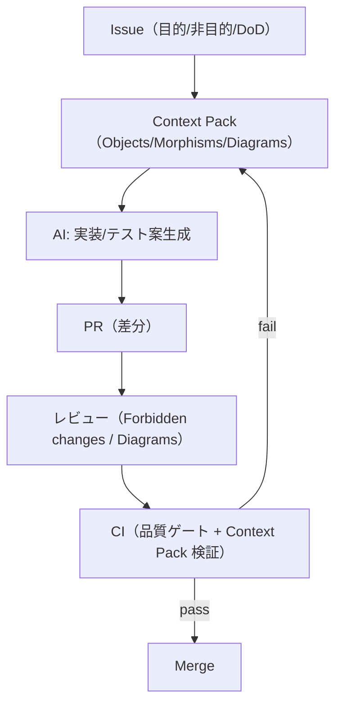

# 第10章: ケーススタディ（仕様→設計→検証→AI実装）

## 学習ゴール

- 例題システムで Context Pack → AI実装 → テスト → レビュー の流れを説明できる
- 図式（Diagrams）が壊れたときの検知・修正フローを設計できる
- GitHub運用（Issue→PR→CI→レビュー）の具体的な運用形を得られる
- AIが勝手に仕様追加/構造破壊する失敗例と、防止策を説明できる
- 自プロジェクトに移植できる手順（最低限の実務手順）を得られる

## 圏論コア（定義・直観・ミニ例）

本章は理論の追加ではなく、前章までの要素（Objects/Morphisms/Diagrams、積/余積、統合図式、効果境界、関手性、自然性）を「運用手順」に落とす章です。よって形式的定義は省略し、設計成果物と検証の流れに集中します。

## ソフトウェア設計への射影（どこに効くか）

ケーススタディの目的は「AIに任せる範囲を増やしつつ、壊れ方を機械的に検知する運用」を作ることです。

本書の最小ループ:

1. Issue で目的/非目的を固定する（曖昧さを残さない）
2. Context Pack（設計成果物）を作る
3. AIへ委任して実装/テスト案を生成する
4. 人間がレビュー（Forbidden changes と Diagrams が基準）
5. CIで破綻検知（リンク/Unicode/構造/textlint + Context Pack 検証）

このリポジトリでは、book-formatter による品質ゲートと、Context Pack の検証（minimal lint + schema validation）をCIへ組み込み済みです（`.github/workflows/ci.yml`）。

## 設計成果物（テンプレ：表/図式/チェックリスト）

参照（仕様と例題）:

- Context Pack v1 仕様: [docs/spec/context-pack-v1.md](../../docs/spec/context-pack-v1.md)
- 共通例題（Context Pack v1）: [docs/examples/common-example/](../../docs/examples/common-example/)

運用で固定する最小セット（DoD）:

- Problem statement（Goals/Non-goals）
- Domain glossary
- Objects / Morphisms（Pre/Post/failures）
- Diagrams（不変条件）＋ verification（検証項目）
- Constraints（性能/セキュリティ/運用）
- Acceptance tests
- Coding conventions
- Forbidden changes

## AIエージェントへの引き渡し

AIに渡すときは「入力契約を守らせる」ことが最優先です。

- 仕様追加を禁止（Non-goals/Forbidden changes）
- 契約改変を禁止（Pre/Post/failures/Diagrams）
- 不足情報は質問させる（補完禁止）

実装委任のプロンプト（骨子）:

> Context Pack を唯一の仕様として実装せよ。  
> Objects/Morphisms/Diagrams/Forbidden changes を変更してはいけない。  
> 受入テスト案を Diagram id に紐づけて出力し、検証可能性を先に確保せよ。  
> 不足情報があれば補完せず質問せよ。

## 検証（テスト観点・可換性チェック）

### 図式が壊れたときの検知・修正フロー

1. 破綻検知:
  - 受入テストが落ちる
  - 図式由来の検証（冪等、監査整合、状態遷移安全性等）が落ちる
2. 原因切り分け:
  - Context Pack の不備（仕様が曖昧/不足/矛盾）
  - 実装の逸脱（Forbidden changes、契約違反、境界破壊）
3. 修正順序:
  - まず Context Pack を修正（仕様を固定）
  - その後に実装を修正（AI再生成も含む）

この順序を守ると、修正が局所解（場当たり）になりにくい。

### GitHub運用（Issue→PR→CI→レビュー）

最小の運用例:

- Issue:
  - 目的/非目的、DoD、関連する Diagrams を明記
- PR:
  - `.github/PULL_REQUEST_TEMPLATE.md` のチェックリストで確認
- CI:
  - book-formatter checks（リンク/Unicode/構造/textlint等）
  - Context Pack 検証（minimal lint + schema validation）

ローカルで CI 相当の主要チェックを再現する場合は `npm run qa` を実行します（レポート: `qa-reports/*.json`）。CIでも Artifacts（qa-reports）に同等レポートが保存され、原因調査を支援します。

## 演習

### 演習1: Context Pack → AI実装 → レビュー（最小）

1. 共通例題 Context Pack を読み、要件を1つ追加する（例: CancelOrder）
2. Context Pack を更新し、Diagrams（不変条件）と verification（検証項目）を追加する
3. Context Pack の検証を通す（minimal lint + schema validation）:
   - minimal lint: `python3 scripts/validate-context-pack.py docs/examples/common-example/context-pack-v1.yaml`（対象: [docs/examples/common-example/](../../docs/examples/common-example/)、スクリプト: [scripts/validate-context-pack.py](https://github.com/itdojp/categorical-software-design-book/blob/main/scripts/validate-context-pack.py)）
   - schema validation: `python3 scripts/validate-context-pack-schema.py docs/examples/common-example/context-pack-v1.yaml`
   - （任意）`npm run qa` で CI 相当の主要チェックを一括実行できる
4. AIへ委任して、実装スケルトンとテスト観点案を生成させる
5. Forbidden changes と Diagrams を基準にレビューし、差し戻し条件を明文化する

### 失敗例（AIが勝手に仕様追加/構造破壊）と防止策

- 失敗例:
  - optional フィールド追加で万能DTO化し、暗黙分岐が増える（契約が肥大化）
  - 境界を統合して責務が混ざる（関手性の破綻）
  - 監査ログが「任意」になり運用要件が壊れる（Diagramsの破綻）
- 防止策:
  - Non-goals/Forbidden changes を先に固定し、仕様追加を禁止する
  - Diagrams をテスト観点へ落とし、破綻を機械検知する
  - pure core / impure shell を維持し、副作用の無断追加を禁止する

## まとめ

- 設計成果物（Context Pack）をSSOTとして固定し、AI委任の入力契約にする
- レビューは Forbidden changes と Diagrams（不変条件）を基準に行う
- 破綻時は「Context Packの修正→実装修正」の順序で運用する
- Issue→PR→CI→レビューのループを作ると、自プロジェクトへ移植可能な運用形になる
