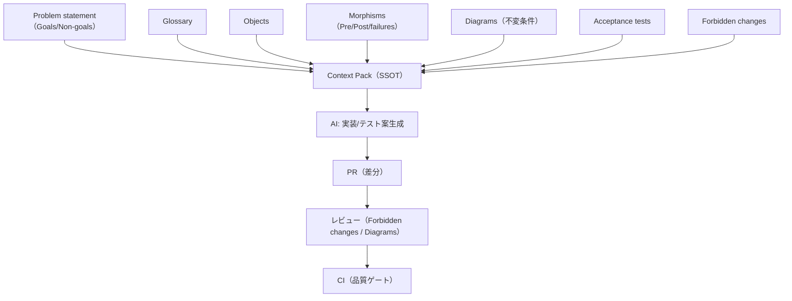

# 圏論によるAIエージェント時代の合成的ソフトウェア設計

仕様・設計・検証を合成可能にする共通言語。

本書は、圏論を「AIに委任可能な実装作業」を安定化させるための共通言語として用い、設計成果物（Context Pack）と検証条件（Diagrams/Acceptance tests）をSSOTとして運用できる形へ落とします。

## 学習成果

- Context Pack（入力契約）を用いて、AIへの委任範囲と責任分界を固定できる
- Objects/Morphisms/Diagrams により、仕様・設計・検証の接続点を成果物として残せる
- 図式（不変条件）をテスト観点へ変換し、CIで破綻を機械検知できる
- 統合/分業/効果境界の“壊れやすい領域”を、図式と検証の単位として扱える

## 想定読者

- AIを用いた実装/テスト生成を運用している（または導入したい）開発者/テックリード
- 仕様追加・境界破壊・検証漏れを、成果物とプロセスで抑止したい方
- GitHub（Issue/PR）とCIで、レビュー可能な差分として運用したい方

## 前提知識

- 実装経験（言語は問わない）
- Git/GitHubの基本操作（Issue/PR）
- テスト/CIの基本（単体/統合、品質ゲート）

## 所要時間（目安）

- 通読: 2〜4時間（章末の演習は除く）
- 演習まで実施: 1〜2日（自プロジェクトに適用する場合は追加）

## 読み方ガイド

- 第1章で、責任分界と「設計成果物＝入力契約」を固定する
- 第2〜6章で、Objects/Morphisms/Diagrams と契約の標準形を最小セットで揃える
- 第7〜9章で、統合/分業/効果境界の破綻点を図式と検証へ落とす
- 第10章で、Issue→PR→CI→レビューの運用形へ接続する

## クイックスタート

1. Context Pack v1 仕様を読む: `docs/spec/context-pack-v1.md`
2. 共通例題を読む: `docs/examples/common-example/context-pack-v1.yaml`
3. Context Packの最小lintを実行する: `python3 scripts/validate-context-pack.py docs/examples/common-example/context-pack-v1.yaml`

## 目次

- [第1章 AIエージェント開発の分担モデルと設計成果物](chapters/chapter01/)
- [第2章 合成の最小コア（対象・射・合成）](chapters/chapter02/)
- [第3章 図式と可換性（仕様をテスト可能にする）](chapters/chapter03/)
- [第4章 関手（仕様→設計→実装の写像）](chapters/chapter04/)
- [第5章 自然変換（差分・リファクタを意味保存で扱う）](chapters/chapter05/)
- [第6章 普遍性（積・余積）で標準化する契約](chapters/chapter06/)
- [第7章 Pullback/Pushout（統合・移行の設計パターン）](chapters/chapter07/)
- [第8章 モノイダル圏とストリング図式（分業と配線）](chapters/chapter08/)
- [第9章 モナド/クライスリ（効果境界の設計）](chapters/chapter09/)
- [第10章 ケーススタディ（仕様→設計→検証→AI実装）](chapters/chapter10/)

## 付録

- [付録A: 設計成果物テンプレ集](appendices/templates/)
- [付録B: AIエージェント用プロンプト集](appendices/prompts/)
- [付録C: 参考文献](appendices/references/)

## 概念マップ

## 用語集

- 用語・訳語のSSOT: `GLOSSARY.md`
- 用語/記法/図式の統一ルール: `docs/style/terminology.md`, `docs/style/notation.md`, `docs/style/diagram-style.md`

## ライセンス

本書は CC BY-NC-SA 4.0 で公開されています。商用利用は別途契約が必要です。

---



**著者:** {{ _author }}  

**バージョン:** {{ site.version | default: '' }}  
**最終更新:** {{ site.time | date: "%Y-%m-%d" }}
