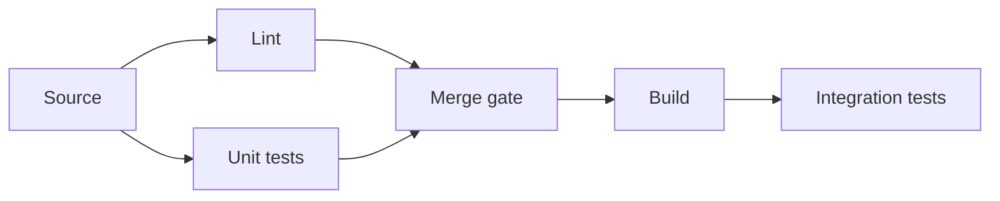

# 第8章: モノidal圏とストリング図式（分業と配線）

## 学習ゴール

- 逐次合成（`∘`）と並列合成（`⊗`）の区別を説明できる
- ストリング図式で接続点・合流点（配線）を可視化できる
- マルチエージェント分業を、入出力と合成規則としてテンプレ化できる
- 例題（CIパイプライン、並列テスト、非同期処理）へ適用できる
- 複数AIエージェントの協調を「設計」として管理できる

## 圏論コア（定義・直観・ミニ例）

モノidal圏（Monoidal category）は、並列合成（テンソル）`⊗` を持つ構造です。ここでは厳密性よりも、分業と配線の直観に必要な部分だけを使います。

- 逐次合成（`∘`）: 前後関係がある処理の連鎖（パイプライン）
- 並列合成（`⊗`）: 独立な処理の並列実行と結果の合成（配線）
- 単位元（`I`）: 並列合成における空の入力/出力（扱いを統一するための概念）

ストリング図式（String diagram）は、対象（データ/成果物）を“線”、射（処理）を“箱”として描き、逐次/並列の接続を可視化します。ソフトウェアでは、データフロー、パイプライン、エージェント間の成果物受け渡しを設計成果物として固定するのに使えます。

## ソフトウェア設計への射影（どこに効くか）

AIエージェントを複数使うと、並列化はできるが破綻しやすい。原因は「入出力の契約」「合成規則」「競合解消」が設計されていないことです。

本章では、マルチエージェント協調を次の形で固定します。

- 役割分割: 何を作るエージェントか（責務）
- 入力/出力: 受け取る成果物、出す成果物（Context Pack、差分、テスト、レビュー結果など）
- 合成規則: 逐次（`∘`）か並列（`⊗`）か、合流点で何を正とするか
- 禁止事項: 互いの境界を壊さない、仕様追加しない、など

例（CIパイプラインの直観）:

- `Lint ⊗ UnitTest` を並列に走らせ、両方が成功したら `Build` へ進む（合流）
- これは「並列合成→逐次合成」の配線として扱える

## 設計成果物（テンプレ：表/図式/チェックリスト）

### エージェント分割テンプレ（最小）

| 項目 | 内容 |
| --- | --- |
| Agent | 名前 |
| 役割 | 何を作るか（例: 実装、テスト、レビュー） |
| 入力 | Context Pack / 既存コード / 制約 / Forbidden changes |
| 出力 | PR、テスト、レポート、レビューコメント |
| 合成規則 | 逐次（`∘`）/並列（`⊗`）、合流時の優先順位 |
| 禁止事項 | 仕様追加、境界変更、依存追加など |

### ストリング図式（簡易表現）

CIの例（概念図）:

同じ構造をマルチエージェントに適用する場合は、`Lint/Unit tests` を「独立な作業（⊗）」として割り当て、合流点（Merge gate）で品質ゲートを満たした成果物のみを次へ渡します。

## AIエージェントへの引き渡し

マルチエージェント運用では、各エージェントに「自分の入出力」と「合成規則」を明示します。

指示の書き方（抜粋）:

> あなたの入力はX、出力はYである。Y以外を変更してはいけない。  
> Forbidden changes を守り、仕様追加は禁止。  
> 並列作業（⊗）の前提として、他エージェントの成果物に依存しないこと。  
> 合流点では、CIレポートとレビュー指摘を優先し、差分を最小化せよ。

## 検証（テスト観点・可換性チェック）

検証は「合流点」を基準に設計します。

- 各エージェントの出力が契約（入力/出力/禁止事項）を満たす
- 合流点で品質ゲート（CI、Diagrams、Acceptance tests）を満たす
- 逐次合成（`∘`）において、後段が前段の出力を前提通りに解釈できる

## 演習

1. 作業を3〜4エージェントに分割する（例: 設計成果物、実装、テスト、レビュー）
2. 各エージェントの入出力と合成規則（逐次/並列）をテンプレで記述する
3. 合流点の品質ゲート（CI/レビュー/Diagrams）を定義する

## まとめ

- 逐次合成（`∘`）と並列合成（`⊗`）を区別して設計すると、分業と配線が破綻しにくい
- ストリング図式は、接続点・合流点を可視化し、マルチエージェント協調を設計成果物として固定できる
