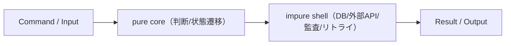

# 第9章: モナド/クライスリ（効果境界の設計）

## 学習ゴール

- pure core / impure shell の設計原則を説明できる
- 失敗モデル・リトライ・冪等性・監査ログを「効果」として境界へ隔離できる
- AIへの指示として「副作用を勝手に増やさない」「境界を守る」を明文化できる
- 図式（Diagrams）から、効果境界のテスト戦略へ落とせる
- 運用要件（監査・信頼性）を破壊しない実装委任ができる

## 圏論コア（定義・直観・ミニ例）

モナド（Monad）とクライスリ（Kleisli）は、効果（IO/DB/例外/リトライ等）を含む計算を合成可能にするための枠組みです。本章では、厳密な公理よりも設計上の直観を優先します。

- 効果付きの型: `M A`（例: `Result<A, E>`, `Task<A>`, `IO<A>`）
- 効果付きの射（クライスリ射）: `A → M B`
- 合成: `A → M B` と `B → M C` を合成して `A → M C` を作る（エラー伝播や副作用の順序を含む）

直観:

「効果を型に押し上げ、合成規則を明示する」と、AIに委任しても境界が崩れにくい。逆に、効果が暗黙（グローバル状態、隠れDBアクセス、暗黙リトライ）だと、合成や検証が破綻します。

## ソフトウェア設計への射影（どこに効くか）

AI委任が難しいのは、効果が絡む領域です。

- IO/DB/外部API
- 例外、再試行、タイムアウト
- 冪等性、監査ログ

本章の基本方針は pure core / impure shell です。

- pure core:
  - ドメイン判断（状態遷移、検証、計算）を純粋関数として定義する
  - 入力→出力が明確でテストしやすい
- impure shell:
  - DB/外部API/監査/リトライなどの効果をここへ閉じ込める
  - 失敗モデル（failures）と再試行規則を Context Pack として固定する



共通例題（注文処理）の観点:

- `PlaceOrder` は在庫引当、監査、状態遷移を含む。ここで効果を増やすと、冪等（D1）や監査整合（D2）が壊れやすい。

## 設計成果物（テンプレ：表/図式/チェックリスト）

参照:

- 共通例題 Context Pack: `docs/examples/common-example/context-pack-v1.yaml`

### 効果境界テンプレ（最小）

| 要素 | 内容 |
| --- | --- |
| pure core | 純粋にできる判断（状態遷移、計算、検証） |
| impure shell | 効果（DB/外部API/監査/リトライ） |
| failures | 失敗モデル（variant列挙） |
| retry | 再試行方針（条件、回数、バックオフ、タイムアウト） |
| idempotency | 冪等性の鍵（キー、スコープ、保持期間） |
| audit | 監査イベント（必須項目、改竄検知） |
| diagrams | 効果境界に関する不変条件（例: D1, D2） |

例（方針イメージ）:

```text
pure core:
  decidePlaceOrder(order, inventory) -> Decision
impure shell:
  loadOrder(orderId) -> IO<Result<Order, NotFound>>
  reserveInventory(order) -> IO<Result<Reservation, OutOfStock>>
  appendAudit(event) -> IO<Unit>
```

## AIエージェントへの引き渡し

効果境界は、AIが勝手に“便利化”しやすい部分です。以下を禁止事項として明確化します。

- 副作用の無断追加（DBアクセス、外部呼び出し、非同期化、リトライ）
- pure core への効果混入（テスト不能化）
- 監査/冪等性の破壊

指示の書き方（抜粋）:

> pure core / impure shell を維持せよ。pure core にIO/DB/外部APIを追加してはいけない。  
> failures/retry/idempotency/audit を Context Pack の通りに実装せよ。勝手に増減してはいけない。  
> 図式（Diagrams）を満たすテスト観点を出力し、破綻を検知できるようにせよ。

## 検証（テスト観点・可換性チェック）

効果境界のテスト戦略は、層ごとに分離します。

- pure core（単体）:
  - 状態遷移、計算、検証ロジック
  - 図式（Diagrams）由来の性質をプロパティとして検証しやすい
- impure shell（統合）:
  - DB/外部API/監査/再試行
  - 冪等性（D1）や監査整合（D2）を観測点（状態/イベント）で検証する

## 演習

1. 共通例題の `PlaceOrder` を取り上げ、pure core と impure shell を分解する
2. failures/retry/idempotency/audit をテンプレに落とす
3. D1（冪等）/D2（監査整合）を壊さないためのテスト観点を列挙する
4. AIに委任する場合の禁止事項（副作用の無断追加、境界破壊）を Context Pack に追記する

## まとめ

- 効果（IO/DB/例外/リトライ等）を型と境界に押し上げ、合成と検証を破綻させない
- pure core / impure shell を維持すると、AI委任後も検証可能性が保たれる
- 冪等性・監査・再試行は境界の契約として固定し、図式（Diagrams）とテスト観点へ接続する
